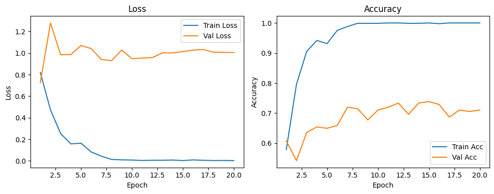
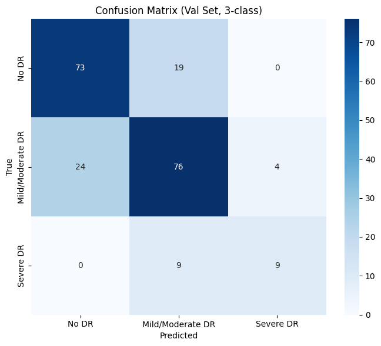
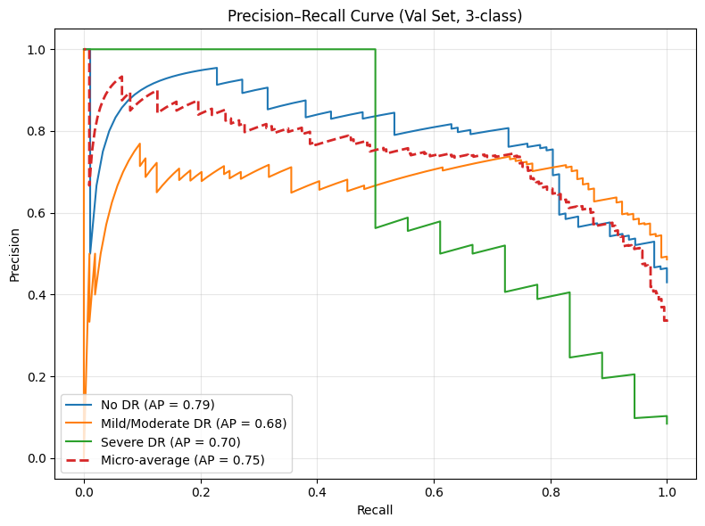
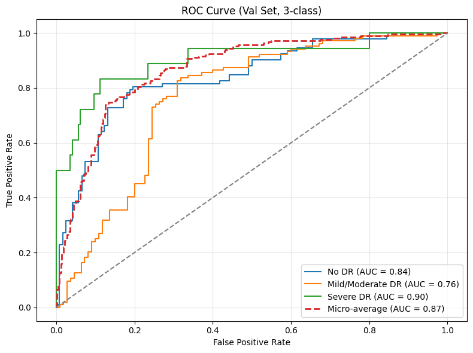
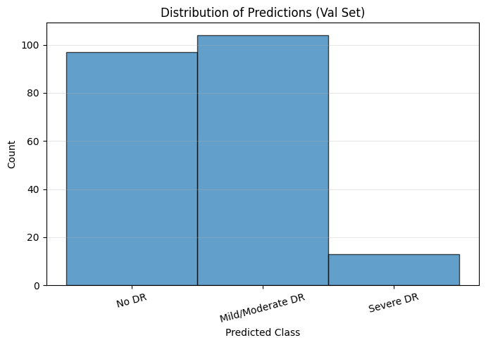

# Diabetic Retinopathy Classification (3-Class)

## 📌 Overview
This repository implements a deep learning classification pipeline to detect and categorize the severity of Diabetic Retinopathy (DR) from retinal fundus images. Utilizing a fine-tuned **ResNet50** architecture and the **Messidor-2 dataset**, this model categorizes retinal images into three clinically actionable severity levels, achieving highly accurate and automated disease detection.

## 🔬 Problem Statement
Diabetic Retinopathy is a leading cause of preventable blindness globally. Early and accurate detection is critical for clinical intervention. This project automates the diagnostic process by deploying a Convolutional Neural Network (CNN) to evaluate retinal fundus images and map them to severity classifications.

### Class Mapping & Simplification
To improve model convergence and clinical relevance, the standard 5-point DR grading scale is mapped to a optimized 3-class system:

| Original Grade | Clinical Description        | Mapped Target Class |
|----------------|-----------------------------|---------------------|
| 0              | No DR                       | **Class 0** |
| 1, 2           | Mild / Moderate DR          | **Class 1** |
| 3, 4           | Severe / Proliferative DR   | **Class 2** |

## 🏗️ Model Architecture & Training Pipeline
* **Backbone:** ResNet50 (Pretrained on ImageNet for robust feature extraction).
* **Architecture Modification:** The final fully connected (FC) layer is replaced to output 3 distinct classes.
* **Optimization:** Adam optimizer with Cross-Entropy Loss.
* **Learning Rate Scheduling:** `ReduceLROnPlateau` to systematically reduce the learning rate when validation accuracy plateaus, ensuring optimal convergence.
* **Data Processing:** * 80/20 Stratified Split to maintain class distribution.
  * Input resolution standardized to 224x224 pixels.
  * Batch size: 32.
  * Epochs: 20 (Best model weights saved based on validation accuracy).

## 📊 Model Evaluation & Results

The model's efficacy is rigorously evaluated using standard classification metrics including Accuracy, F1-Score, Precision, Recall, and Quadratic Weighted Kappa (QWK).

*(Note: The visual results below are generated dynamically during training and testing).*

### Training & Validation Curves


### Confusion Matrix


### Precision-Recall & ROC Curves



### Prediction Distribution


## 🗂️ Dataset Note
This project utilizes the **Messidor-2** dataset. Due to size constraints and licensing, the dataset and the trained model weights (`.pth` files) are strictly excluded from version control via `.gitignore`. 

To run this pipeline locally, you must acquire the Messidor-2 dataset independently and place it in the root directory.

## 🚀 Run Instructions
1. Clone this repository and navigate to the project directory.
2. Install the required dependencies:
   ```bash
   pip install -r requirements.txt